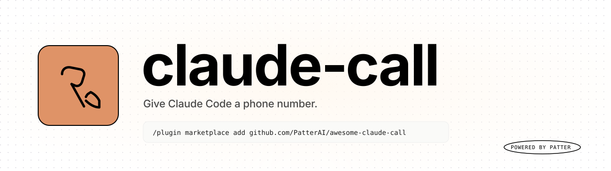

<!--
  claude-call — a Claude Code plugin that gives Claude a phone number.
  Outbound voice calls, inbound voice calls, and "ring me when you're done" notifications,
  built on the Patter SDK over Twilio + OpenAI Realtime / ElevenLabs ConvAI.
  Keywords: claude code plugin, mcp server, voice ai, ai phone agent, twilio, openai realtime,
  elevenlabs convai, telephony, cloudflared, voice agent, anthropic, claude code mcp.
-->

<p align="center">
  <picture>
    <source media="(prefers-color-scheme: dark)" srcset="assets/brand/claude-call-banner-dark.svg" />
    
  </picture>
</p>

<p align="center">
  <a href="https://github.com/PatterAI/awesome-claude-call/releases/latest"></a>
  <a href="LICENSE"></a>
  <a href="https://github.com/PatterAI/awesome-claude-call/actions/workflows/ci.yml"></a>
  
  
  <a href="https://github.com/PatterAI/Patter"></a>
</p>

<p align="center">
  <strong>Give Claude Code a phone number.</strong><br/>
  Make outbound calls, get rung when work is done, talk to your agent from anywhere.
</p>

<p align="center">
  <sub>A Claude Code plugin that bundles an MCP server built on <a href="https://github.com/PatterAI/Patter">Patter</a>. The plugin layer holds no voice code &mdash; it composes existing telephony.</sub>
</p>

---

## What it does

Three flows, one plugin install, real phone calls.

| Flow | What happens | Example |
|---|---|---|
| **Claude &rarr; third party** | Outbound. Claude dials, negotiates against an objective, and returns a structured outcome. | `/claude-call:call-me +15555550200 book a table for 2 at 8pm Saturday` |
| **Claude &rarr; you** | Stop hook. When the long task finishes, Claude rings you with a summary you can talk back to. | `/claude-call:notify-me +15555550100` |
| **You &rarr; Claude** | Inbound. Dial your Twilio number from anywhere, drop straight into a voice conversation with the active session. | `/claude-call:serve-me` |

Every outbound prompt includes a hard-coded AI disclosure on the first turn, every phone number is redacted to last-4 in logs, and every credential lives in a mode-`0600` file in your home directory.

---

## Requirements

| Requirement | Why |
|---|---|
| **Twilio** Account SID, Auth Token, and a phone number you own | Carrier &mdash; this is how the call leaves your machine. |
| **OpenAI** API key | Default `openai_realtime` voice engine. |
| **Claude Code 2.0+**, **Node 20+**, macOS or Linux | Runtime. Windows via WSL is untested. |

Optional alternatives, pick at most one:

- **ElevenLabs ConvAI** &mdash; needs `ELEVENLABS_API_KEY` and `ELEVENLABS_AGENT_ID`.
- **Pipeline mode** &mdash; Deepgram STT, ElevenLabs TTS, OpenAI LLM (all three keys).

---

## Install

Open any Claude Code session (terminal, desktop app, or IDE extension) and run:

```text
/plugin marketplace add https://github.com/PatterAI/awesome-claude-call
/plugin install claude-call@claude-call
/claude-call:setup
/exit
```

That is the entire setup. The four steps:

1. **Add the marketplace.** Clones this repo into `~/.claude/plugins/`.
2. **Install the plugin.** Registers the bundled MCP server, slash commands, hooks, and the `phone-agent` subagent. No `npm install` is required &mdash; the server ships with pre-built `dist/` files.
3. **Configure credentials.** The wizard asks for Twilio Account SID, Auth Token, phone number, and an OpenAI key. If a `.env` already has those, it can import them directly. Credentials land in `~/.claude-call/credentials` (mode `0600`) and are never stored anywhere else.
4. **Restart the session.** The bundled MCP server picks up the new credentials on the next `claude` launch.

Then place a call:

```text
/claude-call:call-me +15551234567 say hello and confirm the line works
```

The Cloudflare tunnel spins up lazily on the first outbound call &mdash; no manual webhook setup, no `ngrok`.

> Already have credentials? Skip to step 4.
> Updating an existing install? Re-run `/claude-call:setup`, then `/exit`.

---

## Quick start

```text
> /claude-call:call-me +15555550200 ask if there is a table for 2 at 8pm tonight
```

Claude dispatches the `phone-agent` subagent, dials, has the conversation, and reports back:

```text
Confirmed. Table for 2 at 20:00 tonight, under "Smith".
Transcript: 4 turns - Duration: 28s - Cost: $0.04
```

---

## Slash commands

| Command | Behavior |
|---|---|
| `/claude-call:call-me <number> <objective>` | Outbound call to a third party with autonomous goal pursuit. |
| `/claude-call:notify-me <number>` | Arms a Stop hook. Claude calls you when the current task finishes. |
| `/claude-call:notify-me-cancel` | Disarms `/claude-call:notify-me`. |
| `/claude-call:dial-me-on-blocked <number>` | Arms a Notification hook. Claude calls you whenever it stalls on permission or idle prompts. |
| `/claude-call:dial-me-on-blocked-cancel` | Disarms `/claude-call:dial-me-on-blocked`. |
| `/claude-call:calls` | Lists recent calls (status, duration, cost). |
| `/claude-call:serve-me` | Arms the inbound voice agent &mdash; callers reach Claude. |
| `/claude-call:serve-me-cancel` | Disarms inbound. |

Numbers must be E.164, e.g. `+15555550100`.

---

## How it works

```text
Claude Code session
  /claude-call:* slash commands     phone-agent subagent     Stop / Notification / SessionStart hooks
                       \                  |                  /
                        \                 |                 /
                         v                v                v
                          stdio MCP transport
                                  |
                                  v
                       bundled server  (server/, ~800 LOC TS)
                       make_call - call_third_party - get_calls - get_transcript
                                  |
                                  v
                        Patter SDK + Cloudflare tunnel  (lazy, first call)
                                  |
                                  v
                              Twilio - PSTN
```

The plugin layer is roughly **700 lines** of shell and markdown. The bundled server in `server/` is roughly **800 lines** of TypeScript that wraps the [`getpatter`](https://www.npmjs.com/package/getpatter) SDK directly &mdash; no external `patter-mcp` repo required.

Port discovery probes a range (`[8002, 8099]` by default) and picks one that is bindable on `127.0.0.1` *and* silent on `::1`. The dual check is load-bearing &mdash; probing only IPv4 would miss a Docker IPv6 hijack; probing only IPv6 would miss a stray IPv4 conflict.

---

## Configuration

| Path or var | Default | Purpose |
|---|---|---|
| `~/.claude-call/credentials` | &mdash; | Telephony credentials (mode `0600`). Managed by `/claude-call:setup`. |
| `~/.claude-call/calls.ndjson` | &mdash; | Append-only call history. |
| `~/.claude-call/log.ndjson` | &mdash; | Append-only event log (phone numbers redacted). |
| `~/.claude-call/inbound-armed` | &mdash; | Flag file. Created by `/claude-call:serve-me`, removed by its cancel command. |
| `CLAUDE_CALL_STATE_DIR` | `~/.claude-call/state` | Flag-file directory for armed hooks. |
| `CLAUDE_CALL_LOG` | `~/.claude-call/log.ndjson` | Override the log path. |

---

## Privacy and security

| Guarantee | How it's enforced |
|---|---|
| AI disclosure on every outbound call | Hard-coded into outbound system prompts on the first turn. Non-overridable in v0.2. |
| Phone numbers redacted to last-4 in all logs | `cc_redact_phone` runs on every log line that touches a number. |
| Credentials file mode `0600` | Server refuses to start if the file is world- or group-readable. |
| State directory mode `0700` | Created with `mkdir -m 0700` &mdash; owner-only. |
| No surprise outbound HTTP from the plugin | Only Twilio, OpenAI / ElevenLabs / Deepgram, and Cloudflare's tunnel control plane (when serving inbound or after the first outbound call). |
| Rate limits and budget caps | Enforced upstream by Patter. |

---

## Development

```bash
make install-dev    # verify bats + jq + node are installed
make ci             # full CI: server build + typecheck + test + bats
make server-test    # bundled server tests only
make test           # bats tests only
make lint           # shellcheck (best-effort)
```

GitHub Actions CI runs on every push and PR (Ubuntu and macOS matrix). Manual end-to-end smoke tests live in [`tests/e2e.md`](tests/e2e.md) and require real Twilio credentials.

---

## Project docs

| Doc | What's in it |
|---|---|
| [`CHANGELOG.md`](CHANGELOG.md) | Versioned change log. |
| [`tests/e2e.md`](tests/e2e.md) | Manual end-to-end smoke-test checklist. |
| [`SECURITY.md`](SECURITY.md) | How to report a security issue. |
| [`CITATION.cff`](CITATION.cff) | Cite this work. |

---

## License

[MIT](LICENSE) &copy; 2026 PatterAI. Built on [Patter](https://github.com/PatterAI/Patter).
